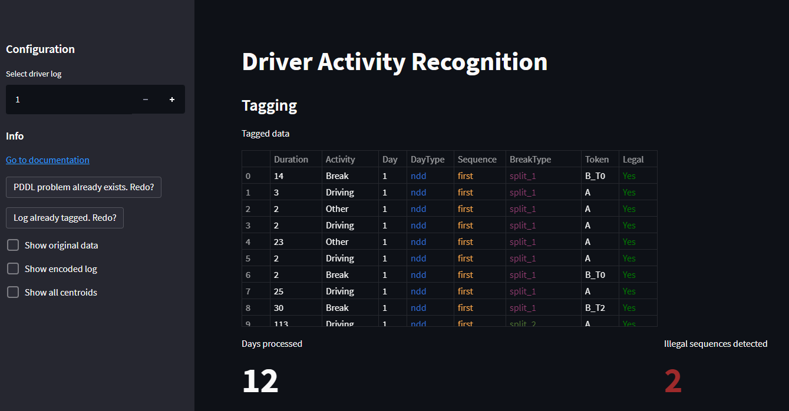
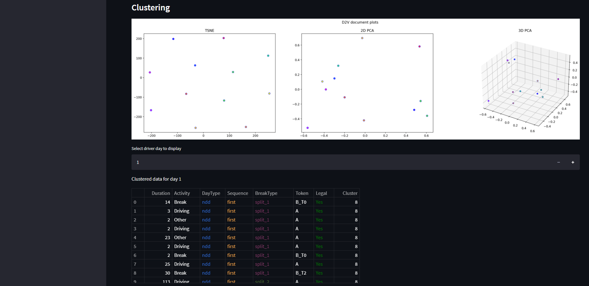
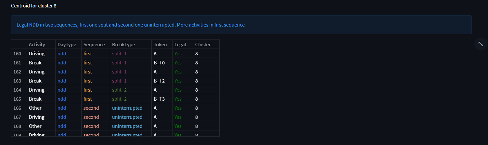
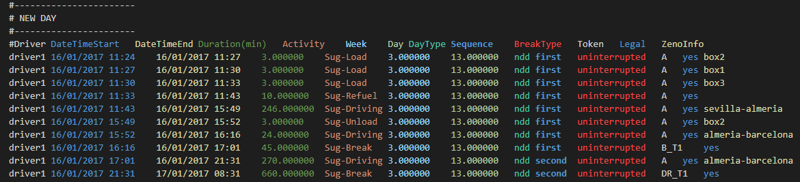

# IMLAP - Driver Activity Recognition

A system to:

- Tag driver activity in compliance with the Hours Of Service regulation.
- Suggest legal transport activities in accordance to fuel consumption.
- Cluster driving sequences for an easy monitoring of driver behavior.

## :unlock: Requirements

### Setting the HTN planner

We use the SIADEX HTN planner based on HPDL. To install it get it [here](https://github.com/IgnacioVellido/VGDL-to-HTN-Parser/tree/master/planners/Siadex), create a directory called ``planner`` under the root directory and compile it in there (a ``planner`` executable file should be generated)

### Setting everything else

We recommend using Anaconda and setting conda environment [environment.yml](./environment.yml) via the command:

```bash
conda env create -f environment.yml
```

Nevertheless, if you don't want to use Anaconda the main Python packages are:

- Python 3
- Numpy
- Gensim (4.1.2 or superior)
- Pandas
- Scikit-learn
- Matplotlib
- Streamlit (only for the app)

## :computer: Usage

Each module can be called separately or together via a local web app.

### WEB App





We have made and interactive web app to test each module with our given data.
Once installed, executing the command will open a tab in your browser:

```bash
streamlit run ./src/app.py
```

### Translating tachograph data into HTN knowledge

We provide Python scripts to transform a tachograph into HTN domains and problems.more precisely, ``./parsers/``

```bash
python ./src/parsers/fromCSVtoPLAN.py <csv_file>

and then, given the <driver_name> for the driver sequence to tag:

python ./src/parsers/fromPLANtoPDDL.py ./out/plan/event-log-<driver_name>.plan
```

Please see our data examples as input files require specific formatting.

### Tagging Driver Activities

With a previously defined problem, just call the SIADEX planner with the following command:

```bash
./planner/planner -d hpdl/domain.pddl -p <problem.pddl> -o <output_path>
```

or calling the script:

```bash
./scripts/runPlanner.sh <domain.pddl> <problem.pddl> <ouput_path>
```

A tagged log in TSV format will be outputted.

### Suggesting driver activities



The HPDL domain is also capable of suggesting driver activities based on Zeno-Travel while complying with the HOS regulation. After trying to recognize an optional driver log, new _Drive/Break/Load/Unload/Refuel_ activities will be included at the end indicating how to deliver the specified packages to their destinations.

Please see some of our examples (like [this one](https://github.com/IgnacioVellido/IMLAP-Driver-Activity-Recognition/blob/main/hpdl/problem-driver1.pddl#L1281)) for how to define this problems.

### Clustering

We provide a K-Means model pre-trained using Doc2Vec in our data, which can be loaded from the ``src/model`` folder.
Each of the 25 centroids can be found in format the ``out`` folder.

## ⏲️ HOS Regulation

Detailed information about the regulation on which the project is based can be found [here](doc/HOS_regulation.md).

## :handshake: Contributing

We will gladly hear any feedback you may have, so don't be shy and open an issue whenever you want.
If you also want to contribute to this project please consider opening a PR. All contributions are welcome! :smile:
