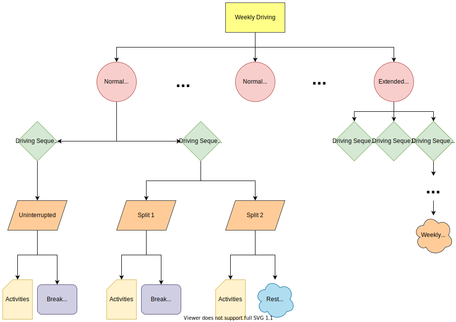
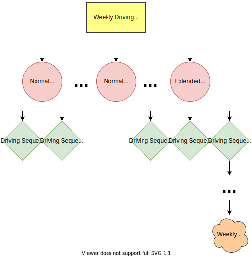
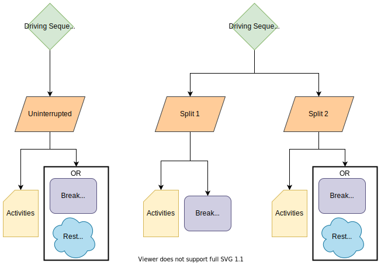

# ⏲️ HOS Regulation

This projects is based on the european **H**ours **O**f **S**ervice regulation No 561/2006 (you can find a copy of it [here](https://eur-lex.europa.eu/legal-content/EN/ALL/?uri=CELEX%3A32006R0561)). The most important elements to consider are reflected in the following images:

A detailed explanation from (Legal aspects in road transport optimization in Europe, Asvin Goel): 

*According to Regulation (EC) No 561/2006, a driver must not drive for more than 4.5h without taking a break of at least 45 min duration, during which the driver may not carry out any work. The break can also be taken in two parts, whereas the first part must have a duration of at least 15 min and the second part must have a duration of at least 30 min.
After a total of 9h of driving, a driver must take a rest period of 11h duration, during which the driver may freely dispose of her or his time. Similar to break periods, rest periods can also be taken in two parts, whereas the first part must have a duration of at least three hours and the second part must have a duration of at least nine hours. Thus, if a rest period is taken in two parts, a total rest of 12h is required before the driver may continue to drive again.
Three times a week, the regular duration of a rest period may be reduced to at least 9h, and twice a week, the total driving time between rests may be extended to 10 h. In any case, the required amount of rest must have been taken within 24 h after the end of the previous rest period.
The accumulated amount of driving and the accumulated amount of working within a week are restricted to at most 56 and 60h and a weekly rest period of at least 45 h must be taken after at most 144 h after the end of the previous weekly rest period. Alternatively, a reduced weekly rest period of 24 h may be taken if the reduction is compensated by an equivalent period of rest taken in a subsequent week.
The regulation constrains the total accumulated driving time during any two consecutive calendar weeks to at most 90 h and in any period of four months, the average working time during a calendar week must not exceed 48 h.*

## :pencil: Notation

We used the following notation for activity tokens:

| Symbol | Meaning                                |
|--------|----------------------------------------|
| CDD    | Continuous Driving Day                 |
| NDD    | Normal Driving Day (<=9h)              |
| EDD    | Extended Driving Day (9h,10h]          |
| | |
| B_T1   | Uninterrupted Break Type 1 (>45m)      |
| B_T2   | First split of Split-Break (>15m)      |
| B_T3   | Second split of Split-Break (>30m)     |
| | |
| DR_T1  | Normal Daily Rest (>11h)               |
| DR_T2  | Reduced Daily Rest [9h,11h]            |
| DR_T3  | First split of Split Daily Rest (>3h)  |
| DR_T4  | Second split of Split Daily Rest (>9h) |
| | |
| WR_T1  | Normal Weekly Rest (>45h)              |
| WR_T2  | Reduced Weekly Rest [24h,45h]          |

## :books: Experimentation and output example

Results are based in our data are stored in the **out** folder, and in this table you can find an example for a legal driving sequence followed by a transport suggestion:

| **#Driver** | **DateTimeStart** | **DateTimeEnd**  | **Duration(min)** | **Activity** | **Week** | **Day**   | **DayType** | **Sequence** | **BreakType** | **Token** | **Legal** | **ZenoInfo** |
|-------------|-------------------|------------------|-------------------|--------------|----------|-----------|-------------|--------------|---------------|-----------|-----------|--------------|
| driver1 | 15/01/2017 11:56 | 15/01/2017 12:00 | 4   | Driving     | 3 | 12 | edd | first  | uninterrupted | A     | yes |                   |
| driver1 | 15/01/2017 12:00 | 15/01/2017 12:04 | 4   | Break       | 3 | 12 | edd | first  | uninterrupted | B_T0  | yes |                   |
| driver1 | 15/01/2017 12:04 | 15/01/2017 12:05 | 1   | Driving     | 3 | 12 | edd | first  | uninterrupted | A     | yes |                   |
| driver1 | 15/01/2017 12:05 | 15/01/2017 12:08 | 3   | Other       | 3 | 12 | edd | first  | uninterrupted | A     | yes |                   |
| driver1 | 15/01/2017 12:08 | 15/01/2017 14:16 | 128 | Break       | 3 | 12 | edd | first  | uninterrupted | B_T1  | yes |                   |
| driver1 | 15/01/2017 14:16 | 15/01/2017 14:19 | 3   | Driving     | 3 | 12 | edd | second | split_1       | A     | yes |                   |
| driver1 | 15/01/2017 14:19 | 15/01/2017 14:25 | 6   | Break       | 3 | 12 | edd | second | split_1       | B_T0  | yes |                   |
| driver1 | 15/01/2017 14:25 | 15/01/2017 14:28 | 3   | Other       | 3 | 12 | edd | second | split_1       | A     | yes |                   |
| driver1 | 15/01/2017 14:28 | 15/01/2017 14:29 | 1   | Driving     | 3 | 12 | edd | second | split_1       | A     | yes |                   |
| driver1 | 15/01/2017 14:29 | 15/01/2017 14:39 | 10  | Break       | 3 | 12 | edd | second | split_1       | B_T0  | yes |                   |
| driver1 | 15/01/2017 14:39 | 15/01/2017 14:55 | 16  | Driving     | 3 | 12 | edd | second | split_1       | A     | yes |                   |
| driver1 | 15/01/2017 14:55 | 15/01/2017 15:21 | 26  | Break       | 3 | 12 | edd | second | split_1       | B_T2  | yes |                   |
| driver1 | 15/01/2017 15:21 | 15/01/2017 19:16 | 235 | Driving     | 3 | 12 | edd | second | split_2       | A     | yes |                   |
| driver1 | 15/01/2017 19:16 | 15/01/2017 19:48 | 32  | Break       | 3 | 12 | edd | second | split_2       | B_T3  | yes |                   |
| driver1 | 15/01/2017 19:48 | 15/01/2017 21:48 | 120 | Driving     | 3 | 12 | edd | third  | split_1       | A     | yes |                   |
| driver1 | 15/01/2017 21:48 | 15/01/2017 22:23 | 35  | Break       | 3 | 12 | edd | third  | split_1       | B_T2  | yes |                   |
| driver1 | 15/01/2017 22:23 | 16/01/2017 00:24 | 121 | Driving     | 3 | 12 | edd | third  | split_2       | A     | yes |                   |
| driver1 | 16/01/2017 00:24 | 16/01/2017 11:24 | 660 | Sug-Break   | 3 | 12 | edd | third  | split_2       | DR_T1 | yes |                   |
| driver1 | 16/01/2017 11:24 | 16/01/2017 11:27 | 3   | Sug-Load    | 3 | 13 | ndd | first  | uninterrupted | A     | yes | box2              |
| driver1 | 16/01/2017 11:27 | 16/01/2017 11:30 | 3   | Sug-Load    | 3 | 13 | ndd | first  | uninterrupted | A     | yes | box1              |
| driver1 | 16/01/2017 11:30 | 16/01/2017 11:33 | 3   | Sug-Load    | 3 | 13 | ndd | first  | uninterrupted | A     | yes | box3              |
| driver1 | 16/01/2017 11:33 | 16/01/2017 11:43 | 10  | Sug-Refuel  | 3 | 13 | ndd | first  | uninterrupted | A     | yes |                   |
| driver1 | 16/01/2017 11:43 | 16/01/2017 15:49 | 246 | Sug-Driving | 3 | 13 | ndd | first  | uninterrupted | A     | yes | sevilla-almeria   |
| driver1 | 16/01/2017 15:49 | 16/01/2017 15:52 | 3   | Sug-Unload  | 3 | 13 | ndd | first  | uninterrupted | A     | yes | box2              |
| driver1 | 16/01/2017 15:52 | 16/01/2017 16:16 | 24  | Sug-Driving | 3 | 13 | ndd | first  | uninterrupted | A     | yes | almeria-barcelona |
| driver1 | 16/01/2017 16:16 | 16/01/2017 17:01 | 45  | Sug-Break   | 3 | 13 | ndd | first  | uninterrupted | B_T1  | yes |                   |
| driver1 | 16/01/2017 17:01 | 16/01/2017 21:31 | 270 | Sug-Driving | 3 | 13 | ndd | second | uninterrupted | A     | yes | almeria-barcelona |
| driver1 | 16/01/2017 21:31 | 17/01/2017 08:31 | 660 | Sug-Break   | 3 | 13 | ndd | second | uninterrupted | DR_T1 | yes |                   |
